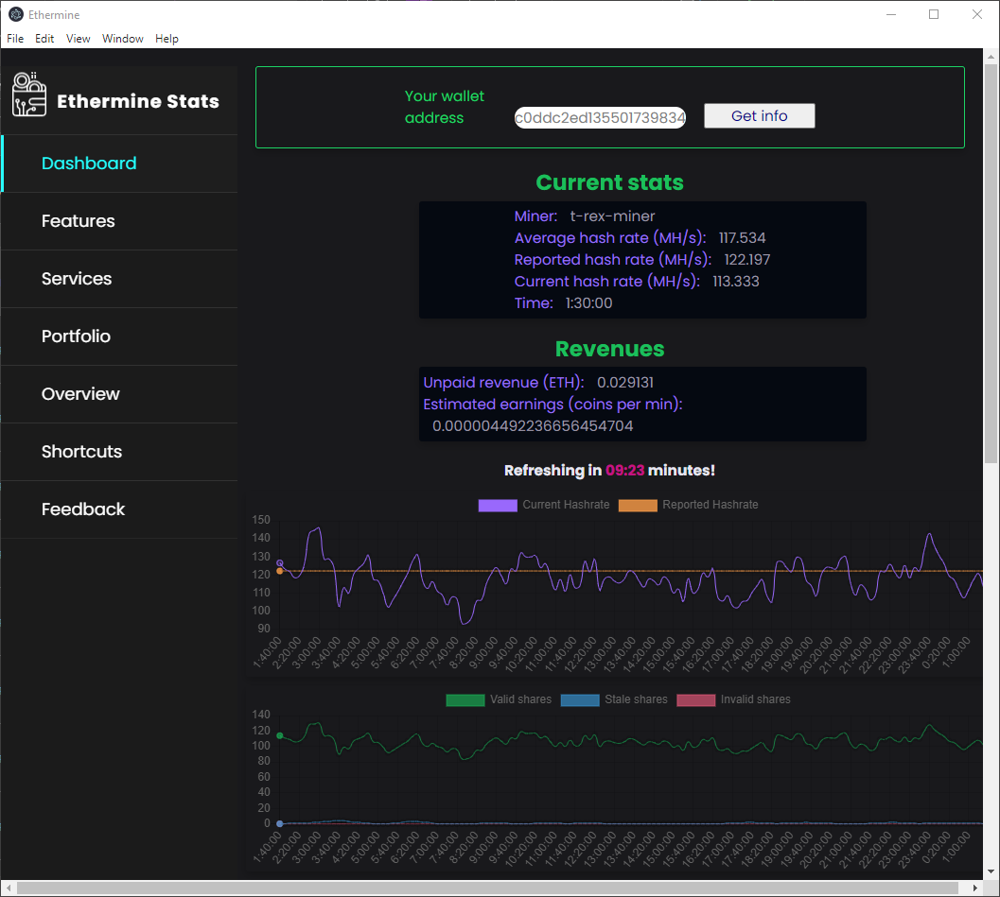

# Ethermine electron app
Create a electron app to consume Ethermine pool API.  
Very early (and slow) development at the moment, working on it in my free time :grin:

First implementation looks like this:

Current form:

TODO:
- Add pool stats
- Implement automatic refresh
- General improvements in UI/UX